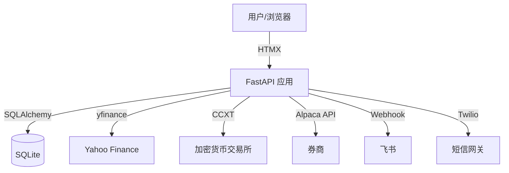
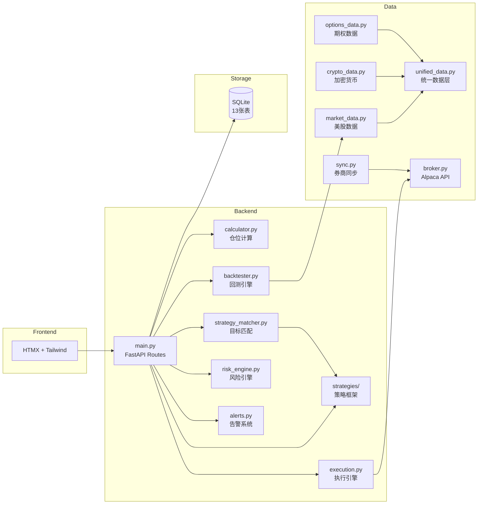
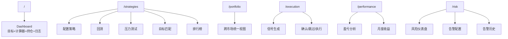
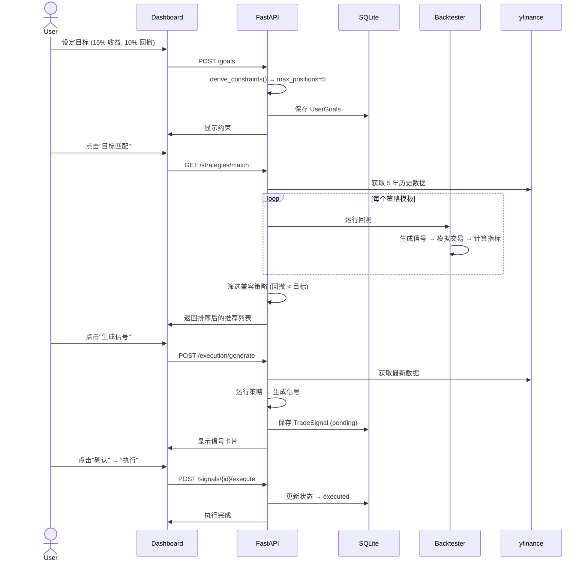
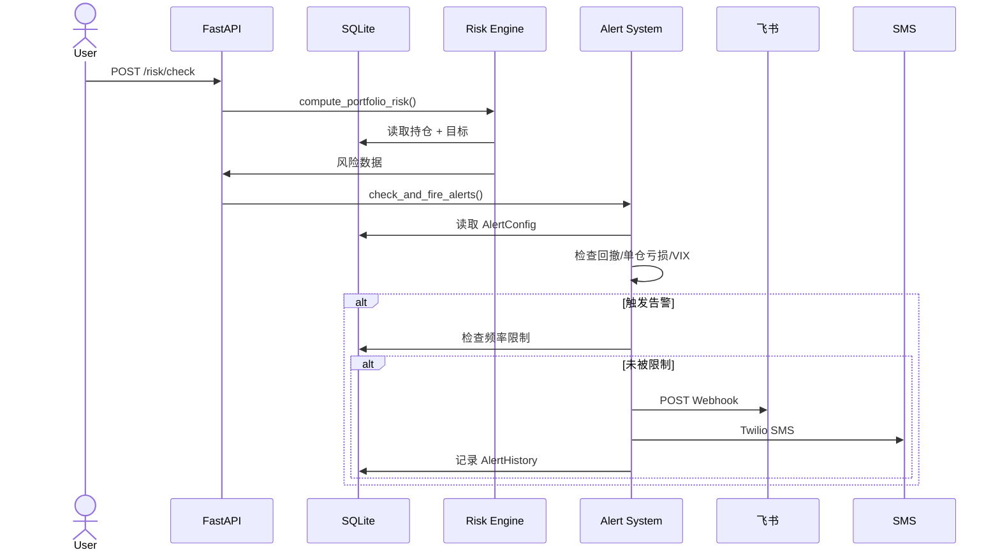
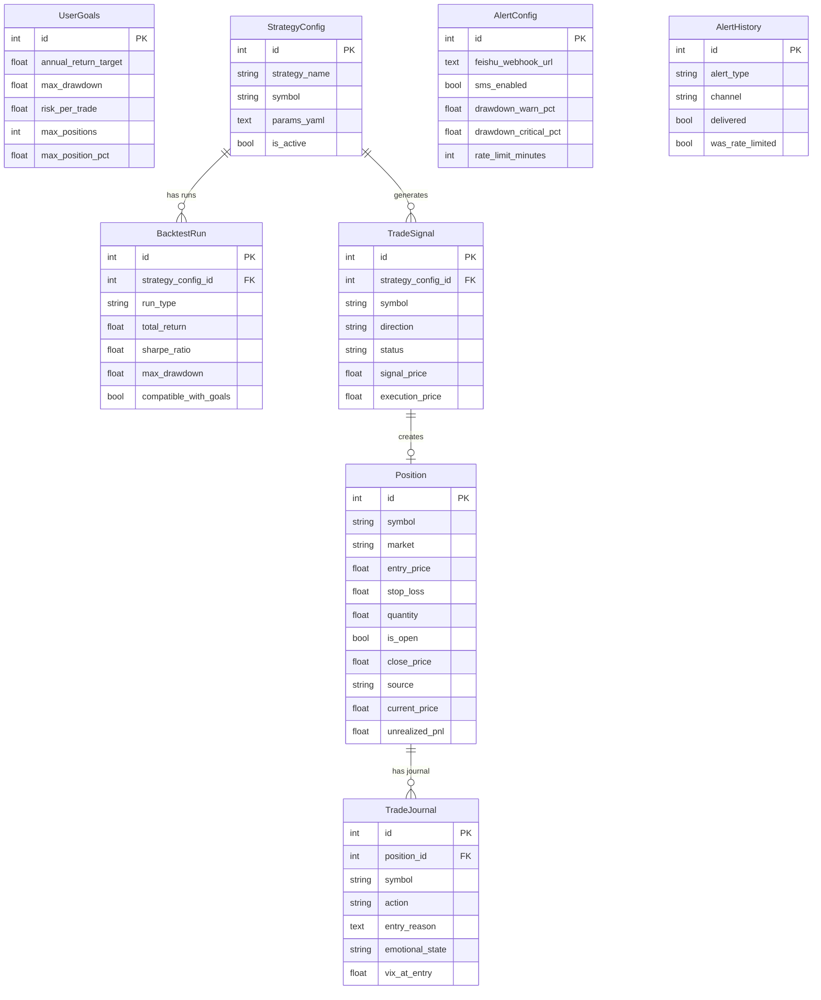

# Goal-Driven Trading OS — Software Design Document

**Version:** 1.5.0
**Date:** 2026-04-21
**Author:** AI-assisted (Claude)
**Status:** Approved

---

## 1. Introduction（引言）

### 目的
描述 Goal-Driven Trading OS 的完整系统设计，一个风险优先的量化交易操作系统。

### 范围
覆盖 Phase 1-5 全部功能：目标设定、仓位计算、策略框架、多市场支持、执行引擎、风险告警。

### 读者
系统开发者（AI）、产品决策者（用户）。

### 术语表
| 术语 | 定义 |
|------|------|
| Drawdown | 从最高点到最低点的跌幅百分比 |
| Sharpe Ratio | 风险调整后收益指标 (收益/波动率) |
| Walk-Forward | 将数据分为训练集和测试集的回测验证方法 |
| VIX | CBOE 波动率指数，衡量市场恐慌程度 |
| ATR | 平均真实波幅，衡量价格波动范围 |
| HTMX | 轻量前端框架，通过 HTML 属性实现 AJAX |
| dry_run | 模拟交易模式，信号和下单流程不变，但订单不发往真实券商 |
| Hyperopt | 超参数优化，自动搜索策略参数空间找出满足目标的最优参数组合 |
| Regime | 市场状态分类（低波牛市/正常/高波/危机），基于 VIX 水平判断 |
| Paper Trading | 模拟实盘，用真实价格但不用真实资金，用于验证策略实时行为 |

---

## 2. System Overview（系统概览）

### 产品描述
风险优先的量化交易系统。用户设定收益/回撤目标 → 系统推导约束 → 匹配策略 → 回测验证 → 执行交易 → 监控风险。

> 产品版本路线图见 `docs/ROADMAP.md`。

### 设计目标
- **性能：** 单用户本地运行，API 响应 < 200ms
- **安全：** API 密钥通过环境变量管理，绝不硬编码
- **扩展：** SQLAlchemy ORM 隔离数据库层，支持 SQLite → PostgreSQL 迁移
- **维护：** AI 生成代码，模块化设计，77 个自动化测试

### 技术栈

| 层级 | 技术 | 版本 |
|------|------|------|
| 后端 | Python + FastAPI | 3.12 / 0.135 |
| 数据库 | SQLite (SQLAlchemy ORM) | 2.0 |
| 前端 | HTMX + Tailwind CSS | 1.9 / CDN |
| 回测 | 自研模拟器 + ta 技术指标库 | - |
| 美股数据 | yfinance | 1.2 |
| 加密货币 | CCXT | 4.5 |
| 券商 | Alpaca API | 0.43 |
| 期权定价 | 自研 Black-Scholes | - |
| 告警 | 飞书 Webhook + Twilio SMS | - |

### 系统上下文图



---

## 3. Architectural Design（架构设计）

### 系统架构图



### 路由地图



---

## 4. Module Decomposition（模块分解）

| 模块 | 文件 | 职责 | 依赖 |
|------|------|------|------|
| 仓位计算 | calculator.py | 风险仓位公式 + 约束推导 | 无 |
| 数据模型 | models.py | 13 张 SQLAlchemy 表 | sqlalchemy |
| 输入验证 | schemas.py | Pydantic 表单验证 | pydantic |
| 市场数据 | market_data.py | yfinance + 技术指标 | yfinance, ta |
| 加密数据 | crypto_data.py | CCXT 交易所数据 | ccxt |
| 期权数据 | options_data.py | 期权链 + Greeks | yfinance, pricing.py |
| 统一数据 | unified_data.py | 路由到正确数据源 | market_data, crypto_data |
| 券商接口 | broker.py | Alpaca API 客户端 | alpaca-py |
| 持仓同步 | sync.py | 券商→本地数据库同步 | broker.py |
| 策略基类 | strategies/base.py | ABC + 注册表 | 无 |
| SMA 交叉 | strategies/sma_crossover.py | 双均线交叉信号 | ta |
| RSI 动量 | strategies/rsi_momentum.py | RSI 超卖/超买信号 | ta |
| 布林带 | strategies/bollinger_reversion.py | 下轨买入/中轨卖出 | ta |
| 回测引擎 | backtester.py | 组合模拟 + WF + 压力测试 | strategies, market_data |
| 策略匹配 | strategy_matcher.py | 目标→策略筛选排序 | backtester, strategies |
| 执行引擎 | execution.py | 信号生成→确认→执行 | strategies, broker |
| 绩效分析 | performance.py | PnL + 月度 + 按市场分解 | models |
| 风险引擎 | risk_engine.py | 风险计算 + 环境检测 | market_data, models |
| 告警系统 | alerts.py | 飞书 + SMS + 频率限制 | httpx, twilio |
| **金渐成评分引擎** | **jin_strategy.py** | **道势法术四层评分 + 5种操作信号 + 分析链路** | **无** |
| **金渐成数据层** | **jin_data.py** | **VPS PostgreSQL 为主 + yfinance 兜底，9标的指标计算** | **market_data, subprocess/SSH** |
| **技术分析引擎** | **ta_engine.py** | **支撑阻力识别 + 海龟系统 + 量价背离，10标的全覆盖** | **jin_data._ssh_query** |
| **墨菲指标库** | **ta_indicators.py** | **20个指标：RSI/MACD/ADX/Fibonacci/道氏趋势/布林带/SAR/趋势线/量价四象限/形态识别（P0-P3）+ combined_signal()加权综合** | **jin_data._ssh_query, ta_engine** |

---

## 5. Data Flow Design（数据流设计）

### 核心流程：目标 → 策略 → 执行



### 告警流程



---

## 6. API Interface Contracts（API 接口契约）

| Method | Path | Input | Output |
|--------|------|-------|--------|
| GET | `/` | - | Dashboard HTML |
| POST | `/goals` | annual_return_target, max_drawdown, risk_per_trade | Goals display partial |
| POST | `/calculate` | account_balance, entry_price, stop_loss | Calc result partial |
| POST | `/positions` | symbol, market, entry_price, stop_loss, quantity, account_balance | Positions list partial |
| POST | `/positions/{id}/close` | close_price | Positions list partial |
| POST | `/journal` | symbol, action, entry_reason, emotional_state | Journal list partial |
| POST | `/sync-positions` | - | Positions list partial |
| GET | `/api/prices/{symbol}` | - | JSON {symbol, price, change_pct} |
| GET | `/strategies` | - | Strategies page HTML |
| POST | `/strategies/configure` | strategy_name, symbol, params_yaml | Config list partial |
| POST | `/strategies/{id}/backtest` | - | Backtest result partial |
| POST | `/strategies/{id}/stress-test` | - | Stress test result partial |
| GET | `/strategies/match` | - | Match result partial |
| GET | `/portfolio` | - | Portfolio page HTML |
| GET | `/execution` | - | Execution page HTML |
| POST | `/execution/generate` | - | Signal list partial |
| POST | `/signals/{id}/confirm` | - | Signal list partial |
| POST | `/signals/{id}/execute` | - | Signal list partial |
| GET | `/performance` | - | Performance page HTML |
| GET | `/risk` | - | Risk page HTML |
| GET/POST | `/alerts/config` | feishu_webhook_url, sms_phone, thresholds | Config page/saved partial |
| POST | `/alerts/test` | - | Test result HTML |
| GET | `/jin-view` | - | 金渐成主页 HTML |
| GET | `/jin-view/{symbol}` | - | 单标的详情页 HTML |
| GET | `/api/jin-view/summary` | - | JSON 数组，9标的完整分析（含 signal + trace） |
| POST | `/api/jin-view/refresh` | - | 清空缓存，强制下次重新拉取 |
| GET | `/api/jin-view/{symbol}/candles` | - | JSON 数组，60根日K线（含 ma50/ma200） |
| GET | `/api/ta/summary` | - | 10标的全量技术信号 JSON |
| GET | `/api/ta/{symbol}/support-resistance` | - | 支撑阻力位列表（含评分、成交量确认） |
| GET | `/api/ta/{symbol}/turtle` | - | 海龟系统状态（System1/System2 + ATR止损 + 仓位建议） |
| GET | `/api/ta/{symbol}/divergence` | - | 量价背离信号（顶部警告/底部参考/无信号） |
| GET | `/indicators` | - | 指标全览页 HTML（墨菲体系 20 指标） |
| GET | `/api/indicators/{symbol}/oscillators` | - | RSI / MACD / Stochastic / Momentum / CCI |
| GET | `/api/indicators/{symbol}/trend` | - | ADX / 布林带 / SAR / 趋势线 / Fibonacci / 道氏理论 |
| GET | `/api/indicators/{symbol}/patterns` | - | 所有形态识别结果（头肩/双顶底/三角/旗形/三重/箱体） |
| GET | `/api/indicators/{symbol}/volume` | - | 量价四象限 / 缺口识别 / 吹顶卖出高潮 |
| GET | `/api/indicators/{symbol}/combined` | - | 加权综合信号（net_score + component_signals） |
| GET | `/api/indicators/summary` | - | 10标的全量信号摘要 |
| POST | `/api/indicators/refresh` | - | 清空指标缓存 |

---

## 7. Database Design（数据库设计）

### ER 图



### 表清单 (13 张)

Phase 1: UserGoals, Position, TradeJournal, JournalCompliance
Phase 1.5: MarketDataCache
Phase 2: StrategyConfig, BacktestRun, TradeSignal, StrategyLeaderboard
Phase 4: ExecutionLog
Phase 5: AlertConfig, AlertHistory

---

## 8. Security（安全设计）

- API 密钥通过 `os.getenv()` 读取，绝不硬编码
- `.gitignore` 排除 `.env`、`*.db`
- FastAPI + Pydantic 验证所有输入
- Phase 1 单用户 admin 模式，无需认证
- 产品化前必须加：JWT 认证、HTTPS、CSRF 保护

---

## 11. Deployment Architecture（部署架构）

### 当前（本地开发）

```bash
cd /Volumes/MaiTuan2T/Quant/app
source ../venv/bin/activate
python -m uvicorn main:app --reload --port 8000
```

### 产品化路线
1. Docker 容器化
2. Fly.io / Railway 部署
3. SQLite → PostgreSQL（改 DATABASE_URL 即可）
4. GitHub Actions CI/CD

---

## 13. Testing Strategy（测试策略）

- **框架：** pytest + httpx (FastAPI TestClient)
- **总测试数：** 77
- **覆盖范围：**
  - calculator.py: 100% 分支覆盖 (22 tests)
  - models.py: CRUD 全覆盖 (9 tests)
  - API endpoints: 集成测试 (12 tests)
  - strategies: 信号生成 + 注册表 (14 tests)
  - backtester: 组合模拟 + 指标计算 (7 tests)
  - risk + alerts: 风险计算 + 频率限制 (8 tests)
  - performance: 绩效分析 (5 tests)

```bash
cd /Volumes/MaiTuan2T/Quant/app
python -m pytest tests/ -v
```

---

## 14. Appendices（附录）

### 文件索引

```
app/
├── main.py              (540 lines)  FastAPI 全部路由
├── models.py            (220 lines)  13 张 SQLAlchemy 表
├── calculator.py        (155 lines)  仓位计算核心
├── schemas.py           (50 lines)   Pydantic 验证
├── market_data.py       (120 lines)  yfinance + 技术指标
├── broker.py            (110 lines)  Alpaca API
├── sync.py              (80 lines)   券商同步
├── crypto_data.py       (90 lines)   CCXT 加密数据
├── options_data.py      (90 lines)   期权链 + Greeks
├── unified_data.py      (40 lines)   统一数据路由
├── backtester.py        (200 lines)  回测 + WF + 压力测试
├── strategy_matcher.py  (100 lines)  目标匹配
├── execution.py         (130 lines)  执行引擎
├── performance.py       (90 lines)   绩效分析
├── risk_engine.py       (100 lines)  风险引擎
├── alerts.py            (140 lines)  飞书 + SMS 告警
├── strategies/
│   ├── base.py          (70 lines)   ABC + 注册表
│   ├── sma_crossover.py (65 lines)
│   ├── rsi_momentum.py  (55 lines)
│   └── bollinger_reversion.py (65 lines)
├── templates/           (12 files)   HTMX 模板
└── tests/               (8 files)    77 个测试
```

### 变更历史

| 版本 | 日期 | 变更 |
|------|------|------|
| 1.0.0 | 2026-03-31 | 初始版本，Phase 1-5 架构设计，CEO + Eng Review 通过 |
| 1.1.0 | 2026-03-31 | 实现：策略发现库 + AI 研究管线 + Backtester v2（WF + 危机测试）+ IBKR 实时数据集成 |
| 1.2.0 | 2026-04-02 | 规划：v1.0/v1.5/v2.0 版本路线图 + 三大新机制（dry_run + Optimizer + Regime Pipeline）+ v1.5 Regime Analyzer 写入 SDD + TODOS |
| 1.3.0 | 2026-04-21 | 新增金渐成视角模块（/jin-view）：道势法术四层评分引擎、9标的操作建议卡片、K线图、分析决策链路可视化。数据层采用 VPS PostgreSQL 为主数据源（SSH tunnel），yfinance 兜底 |
| 1.4.0 | 2026-04-21 | 新增技术分析模块（/technical）：支撑阻力自动识别（摆动点聚类+成交量评分）、海龟交易系统 System1/System2、量价背离检测，10标的全覆盖，VPS PostgreSQL 数据源 |
| 1.5.0 | 2026-04-21 | 新增墨菲指标全览模块（/indicators）：ta_indicators.py 实现 20 个指标（P0: RSI/MACD/ADX/Fibonacci/道氏三级趋势；P1: 布林带/缺口/趋势线/量价四象限/极端情绪；P2: 头肩顶底/双顶底/三角形/旗形楔形/Stochastic/Momentum-ROC；P3: 三重顶底圆弧底/CCI/Parabolic SAR/矩形箱体）+ combined_signal()加权综合信号，纯Python实现，8个API端点 |
